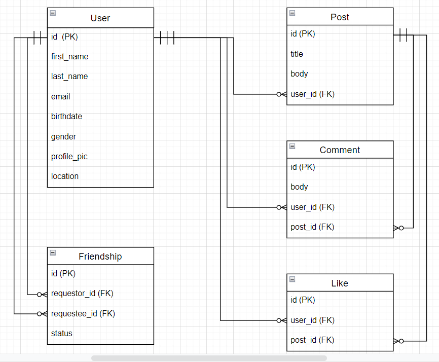
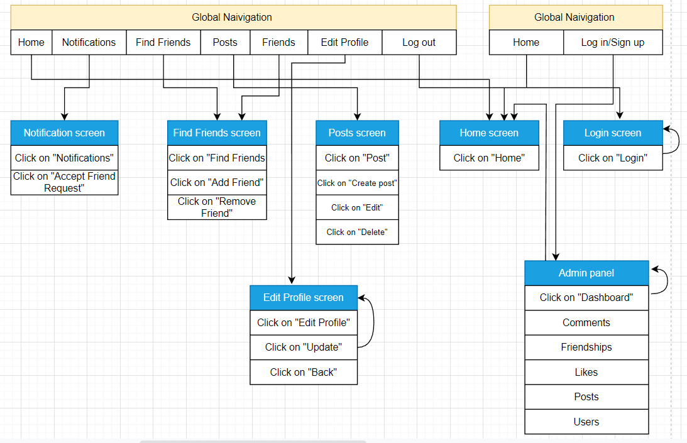

# README						

## Development Language

* Ruby 3.0.1
* Rails 6.0.3

## Employment Term Technology

* devise
* AWS

## Technology outside the curriculum

* omniauth-facebook
* bootstrap-sass

## Execution Procedure

```
$ git clone git@github.com:thadomaloma/senhri_blog.git
$ cd senhri_blog
$ bundle install
$ rails db:create && rails db:migrate
$ rails s
```

## Catalog Design

https://docs.google.com/spreadsheets/d/1qZWB1U37O4doDgel2AG0BjRMk-0WFHznzwqfhcxQ4Bg/edit#gid=1804989209

## Table Definition Document

https://docs.google.com/spreadsheets/d/1qZWB1U37O4doDgel2AG0BjRMk-0WFHznzwqfhcxQ4Bg/edit#gid=1090603487

## Wireframe

https://cacoo.com/diagrams/ZDED31DeytbIe3Wh/ABA65

## ER Diagram



## Screen Transition Diagram


